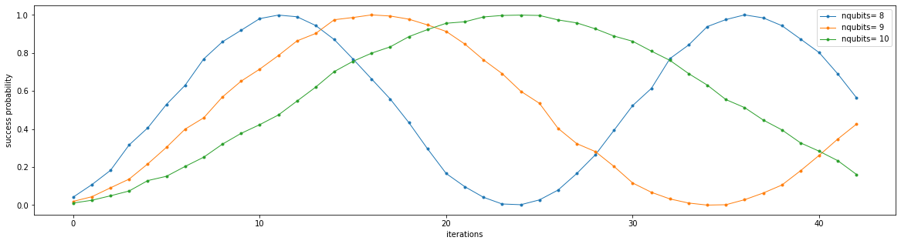
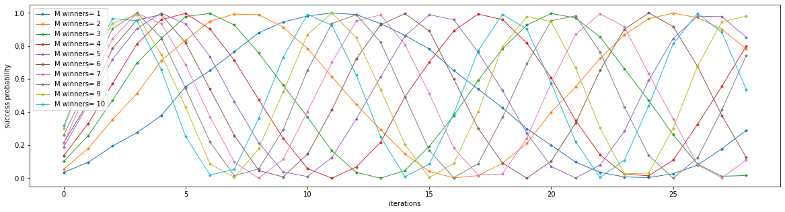

# Grover's Algorithm Implementation and Success Probability Dependence On Grover's Iterates
### Outline
 
Part 1: General Grover's Algorithm
 
&nbsp;&nbsp;&nbsp;&nbsp;1.1. Initialization
 
&nbsp;&nbsp;&nbsp;&nbsp;1.2. Amplitude Amplification: Question some elements (winners)
 
&nbsp;&nbsp;&nbsp;&nbsp;1.3. Amplitude Amplification: Boosting winners amplitudes
 
 
Part 2: Success Probability Dependence On Grover's Iterates
 
&nbsp;&nbsp;&nbsp;&nbsp;2.1. At constant number of winners (M=1)
 
&nbsp;&nbsp;&nbsp;&nbsp;2.2. At constant number of Qubits (n=8, N=$2^8$)
 
&nbsp;&nbsp;&nbsp;&nbsp;2.3. The Conclusive Equation
 

## Plots and Result

$$
\boxed{\boxed{ P_{success}(N,M,t) \approx  sin^2\left( 2\sqrt{\frac{M}{N}} \;t \right)}}
$$
<strong>
$P_{success}$: The probability of getting the right result.
   
N: Length of the list.
 
M: Number of winners/solutions.
 
t: Number of Grover's iterates. (# amplitude amplifications).
<strong/>
